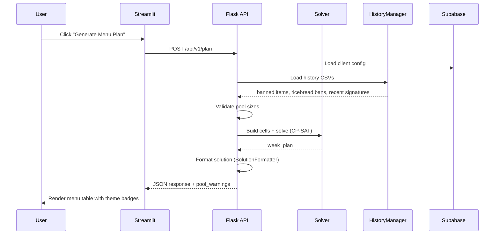
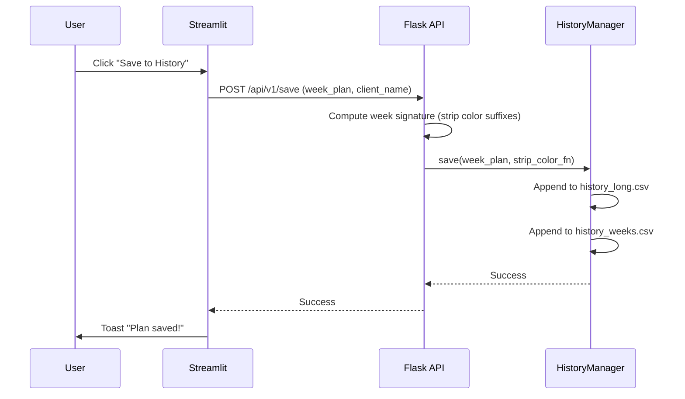

# Ikigai Masala - System Architecture

## Overview

Ikigai Masala is a constraint-based weekly menu planning system for corporate meal providers.
It uses **Google OR-Tools CP-SAT** to generate optimized menus that respect cuisine themes,
item cooldowns, color variety, and per-client customizations.

The app runs as a **Streamlit** frontend with an embedded **Flask** API backend.
Client configuration is stored in **Supabase** (PostgreSQL); menu history is persisted
to local CSV files.

---

## Architecture Diagram

```mermaid
graph TD
    subgraph Frontend ["Streamlit Frontend (app.py)"]
        UI[Menu Planner View]
        ED[Customisation Editor]
    end

    subgraph API ["Flask API (api/app.py)"]
        PLAN[POST /plan]
        REGEN[POST /regenerate]
        SAVE[POST /save]
        VALIDATE[POST /validate-pools]
        CLIENTS[GET /clients]
        CONFIG[GET|PUT /client-config]
        CREATE[POST /client]
    end

    subgraph Core ["Core Engine (src/)"]
        SOLVER[MenuSolver<br/>CP-SAT]
        RULES[MenuRules<br/>19 constraints]
        POOLS[PoolBuilder<br/>per-slot item pools]
        HIST[HistoryManager<br/>cooldown + signatures]
        FMT[SolutionFormatter]
        REGEN_CORE[MenuRegenerator]
    end

    subgraph Data ["Data Layer"]
        EXCEL[(menu_items.xlsx<br/>530+ items)]
        SUPA[(Supabase<br/>clients, slots,<br/>themes, categories)]
        CSV[(CSV History<br/>history_long.csv<br/>history_weeks.csv)]
        RULES_JSON[(indian_menu_rules.json)]
    end

    UI -->|HTTP| PLAN
    UI -->|HTTP| REGEN
    UI -->|HTTP| SAVE
    ED -->|HTTP| CONFIG
    ED -->|HTTP| CREATE

    PLAN --> SOLVER
    PLAN --> HIST
    PLAN --> VALIDATE
    REGEN --> REGEN_CORE
    SAVE --> HIST

    SOLVER --> POOLS
    SOLVER --> RULES

    POOLS --> EXCEL
    HIST --> CSV
    CONFIG --> SUPA
    RULES --> RULES_JSON
    SOLVER --> FMT
```

---

## Layer Breakdown

### 1. Frontend (`app.py`, `customisation/`)

| Component | File | Purpose |
|-----------|------|---------|
| Menu Planner | `app.py` | Generate, view, regenerate, download, save menus |
| Customisation Editor | `customisation/main.py` | Create/edit clients, slots, themes |
| Client Editor | `customisation/client_editor.py` | Create new / select existing clients |
| Slot Editor | `customisation/slot_editor.py` | Toggle active base slots |
| Multi-Slot Editor | `customisation/multi_slot_editor.py` | Set slot counts (e.g. veg_dry x2) |
| Theme Editor | `customisation/theme_editor.py` | Per-day theme overrides |

### 2. API (`api/`)

| Endpoint | Method | Purpose |
|----------|--------|---------|
| `/api/v1/plan` | POST | Generate a full menu plan |
| `/api/v1/regenerate` | POST | Regenerate selected cells |
| `/api/v1/save` | POST | Save plan to history CSVs |
| `/api/v1/validate-pools` | POST | Pre-solve pool size check |
| `/api/v1/clients` | GET | List all clients |
| `/api/v1/client-config/<name>` | GET/PUT | Read/write client config |
| `/api/v1/client` | POST | Create new client |
| `/api/v1/client/<name>` | DELETE | Delete a client |
| `/api/v1/editor-metadata` | GET | Metadata for editor UI |

### 3. Solver (`src/solver/`)

- **MenuSolver** — CP-SAT constraint solver with multi-restart strategy
- **SolverConfig** — Runtime config (days, time limit, slot counts, theme map)
- **SolutionFormatter** — Converts solver output to JSON/CSV/Excel
- **MenuRegenerator** — Regenerates specific (day, slot) cells while keeping others locked

### 4. Menu Rules (`src/menu_rules/`)

19 constraint rules loaded from `indian_menu_rules.json` via factory pattern:

| Rule | Purpose |
|------|---------|
| item_cooldown | 20-day item repeat prevention |
| ricebread_gap | 10-day rice-bread gap |
| theme_cuisine_filter | Filter pools by day theme |
| theme_slot_filter | Chinese veg_dry/starter heuristics |
| unique_items_session | No duplicate items in same day |
| color_variety | Min 4 distinct colors per day |
| color_pairing | Max 2 same-color items per day |
| premium_limits | 1-2 premium items per horizon |
| curd_raita_logic | Curd side with pulao |
| deep_fried_coupling | Coupling constraint |
| nonveg_biryani_weekly | Max 1 biryani per week |
| week_signature_cooldown | 30-day signature dedup |
| welcome_drink_no_repeat_color | Color variety for drinks |
| theme_starter_preference | Bonus for theme-matching starters |
| theme_fallback_penalty | Penalty for non-theme fallback items |
| nonveg_dry_preference | Prefer dry nonveg in slot 2 |

### 5. Data Layer

| Source | Type | Contents |
|--------|------|----------|
| `data/raw/menu_items.xlsx` | Excel | 530+ Indian menu items with cuisine, color, flags |
| Supabase | PostgreSQL | `clients`, `menu_categories`, `slot_count_overrides`, `theme_overrides`, `app_settings` |
| `data/history_long.csv` | CSV | Per-item history (service_date, slot, item_base, client_name) |
| `data/history_weeks.csv` | CSV | Per-week signatures (week_start, week_signature, client_name) |

---

## Key Flows

### Menu Generation Flow



### Save Flow



---

## Technology Stack

| Layer | Technology |
|-------|-----------|
| Frontend | Streamlit 1.30+ |
| API | Flask 3.0+ with CORS |
| Solver | Google OR-Tools CP-SAT |
| Database | Supabase (PostgreSQL) |
| History | Local CSV files |
| Data Processing | Pandas, NumPy |
| Testing | Pytest |
