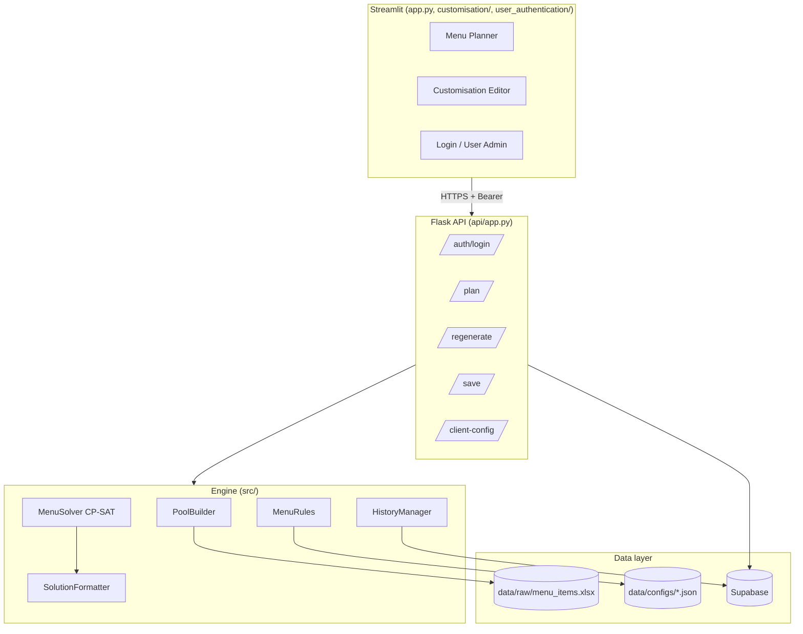
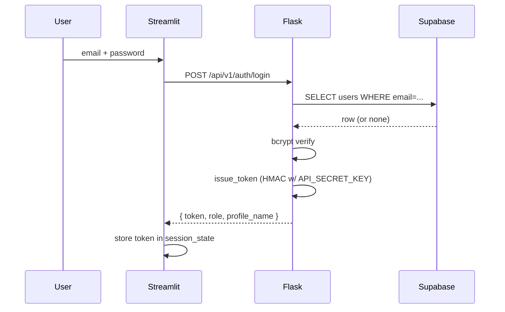
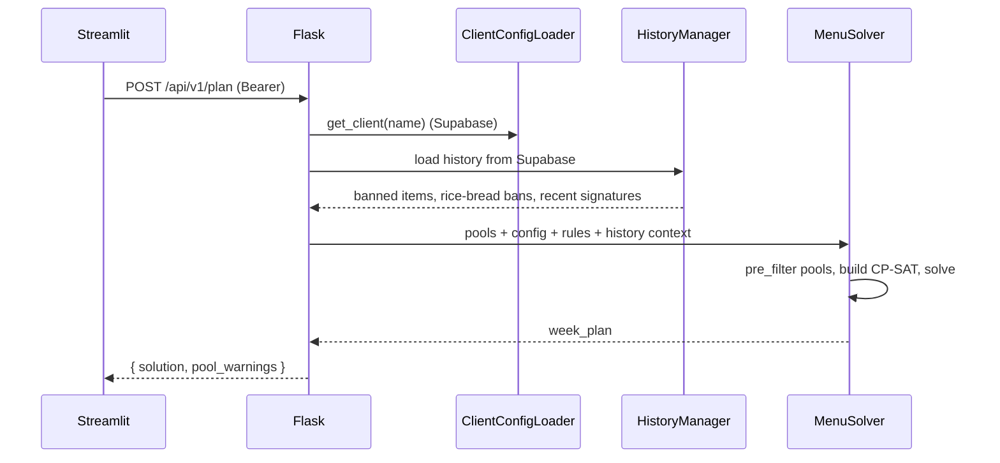

# Ikigai Masala

Constraint-based weekly menu planning for corporate meal providers. Uses Google OR-Tools CP-SAT to generate Indian menus that respect cuisine themes, item cooldowns, color variety, per-client customizations, and history.

- **Frontend:** Streamlit
- **Backend:** Flask API (auto-started by the Streamlit app on port 5000)
- **Solver:** Google OR-Tools CP-SAT
- **Database:** Supabase (PostgreSQL) — clients, users, history, configuration
- **Auth:** bcrypt passwords in Supabase `users` table; signed bearer tokens between Streamlit and Flask

---

## 1. Prerequisites

- Python 3.10+
- A Supabase project (URL + service-role key)
- The three schema scripts applied once (see *Setup*)
- Secrets: `SUPABASE_URL`, `SUPABASE_KEY`, `API_SECRET_KEY`

---

## 2. Setup

### 2.1 Install dependencies

```bash
pip install -r requirements.txt
```

### 2.2 Create Supabase tables

In the Supabase SQL editor, run each of these once:

```
scripts/create_tables.sql          -- clients, menu_categories, slot_count_overrides, theme_overrides, app_settings
scripts/create_history_tables.sql  -- menu_history, week_signatures
scripts/create_users_table.sql     -- users (auth)
```

### 2.3 Configure secrets

The app reads secrets from `.streamlit/secrets.toml` (locally) or the **Secrets** panel on Streamlit Cloud. All three values are required:

```toml
SUPABASE_URL   = "https://<your-project-ref>.supabase.co"
SUPABASE_KEY   = "<service_role / sb_secret_... key — NOT publishable>"
API_SECRET_KEY = "<64-hex string>"
```

Generate `API_SECRET_KEY` locally:

```bash
python -c "import secrets; print(secrets.token_hex(32))"
```

**Key-class notes:**
- `SUPABASE_KEY` must be the **service-role** key (`sb_secret_…` or legacy JWT `eyJ…`). The publishable/anon key obeys Row-Level Security and will block the backend from writing history.
- `API_SECRET_KEY` signs the bearer tokens issued to the Streamlit frontend. Rotating it logs every user out but doesn't break anything else.
- Never commit either secret. Rotate immediately if one leaks.

### 2.4 Seed data

```bash
export SUPABASE_URL=...
export SUPABASE_KEY=...

python scripts/seed_supabase.py   # migrate data/configs/clients.json into Supabase

# Create the first super_admin. Credentials come from env so nothing is
# committed to git. Password must be at least 8 characters.
export ADMIN_EMAIL="you@company.com"
export ADMIN_PASSWORD="<choose a strong password>"
# export ADMIN_NAME="Your Name"   # optional; defaults to the email local part
python scripts/seed_admin.py
```

---

## 3. Run

```bash
cd ikigai_masala-main
streamlit run app.py
```

The Streamlit process auto-spawns the Flask API in a daemon thread on `http://localhost:5000`. Both talk to the same Supabase project.

---

## 4. Architecture



### 4.1 Layer overview

| Layer | Location | Responsibility |
|---|---|---|
| Frontend | `app.py`, `customisation/`, `user_authentication/`, `ui/` | Streamlit views, login form, API client |
| API | `api/app.py`, `api/auth.py`, `api/concurrency.py` | REST surface; bearer-token auth; concurrent-solve gate |
| Solver | `src/solver/` | CP-SAT model, multi-restart strategy, regeneration, solution formatting |
| Rules | `src/menu_rules/` | Hard/soft/pre-filter constraints, loaded from JSON |
| Preprocessor | `src/preprocessor/` | Excel ingest, column mapping, data cleanse, per-slot pool build |
| Client/History | `src/client/`, `src/history/` | Supabase-backed client config and menu history |
| Shared | `src/db.py`, `src/constants.py` | Supabase singleton, slot/flag constants |

### 4.2 Key design choices

- **Cell-based CP-SAT:** one bool variable per `(day, slot, candidate item)`. Enables per-item bonuses/penalties and targeted regeneration.
- **Two-phase rules:**
  1. `pre_filter_pool()` — cheap removals before CP-SAT vars exist.
  2. `apply()` + `get_objective_terms()` — hard constraints and soft bonuses/penalties on the model.
- **Hard vs. soft severity:** rules declare `severity = HARD` (default) or `SOFT`. A hard rule that raises in `apply()` causes the solve to fail fast instead of silently dropping the constraint; soft rules log a warning and continue.
- **No config cache:** `ClientConfigLoader` reads Supabase on every call, so edits are live with no restart.
- **Dynamic worker allocation:** `api/concurrency.py` caps concurrent solves and tunes CP-SAT worker count to RAM (1 active → 9 workers, 2 active → 5 each).
- **History split:** `menu_history` is item-level (one row per `(date, slot, item)`), `week_signatures` is week-level (a deterministic `|`-delimited hash of a saved week). The former drives item cooldown; the latter drives week-signature cooldown.

---

## 5. Key flows

### 5.1 Login



### 5.2 Generate menu



### 5.3 Save

Streamlit → `POST /api/v1/save` → `HistoryManager.save()` writes rows into `menu_history` and a row into `week_signatures`. Color suffixes (`(R)`, `(Y)`, …) are stripped before persistence so cooldown matching is color-agnostic.

### 5.4 Regenerate

Streamlit → `POST /api/v1/regenerate` → `MenuRegenerator` locks every cell not marked for replacement and re-runs the solver. A similarity penalty steers the solver away from re-picking the same items.

---

## 6. API reference

All endpoints are under `/api/v1`. Every endpoint except `/health` and `/auth/login` requires a `Authorization: Bearer <token>` header.

| Method | Path | Purpose |
|---|---|---|
| POST | `/auth/login` | Exchange email + password for a bearer token |
| GET  | `/health` | Liveness check |
| GET  | `/clients` | List client names |
| POST | `/plan` | Generate a plan |
| POST | `/regenerate` | Regenerate selected cells |
| POST | `/save` | Persist plan to history |
| POST | `/validate-pools` | Dry-run pool sizes (no solve) |
| GET  | `/editor-metadata` | Slot/theme metadata for the editor |
| GET  | `/client-config/<name>` | Read a client's config |
| PUT  | `/client-config/<name>` | Update a client's config |
| POST | `/client` | Create a client |
| DELETE | `/client/<name>` | Delete a client |

### 6.1 `/plan` response

```json
{
  "success": true,
  "solution": {
    "2026-03-31": {
      "theme": "Mix of South + North",
      "day_type": "mix",
      "items": {
        "welcome_drink": { "display_name": "Welcome Drink", "item": "masala_chaas(Y)", "item_base": "masala_chaas" },
        "rice":          { "display_name": "Flavor Rice",   "item": "jeera_rice(W)",   "item_base": "jeera_rice" }
      }
    }
  },
  "pool_warnings": [
    "Chinese Tuesday 01 Apr: only 4 veg dry items available, need 3"
  ]
}
```

### 6.2 Error envelope

Failures return HTTP 4xx/5xx with:

```json
{ "success": false, "error": "<human-readable message>" }
```

Auth failures use 401; validation failures use 400; unexpected server errors use 500 and include the exception class name for diagnosability.

---

## 7. Menu rules

Defined in `src/menu_rules/`, wired up from `data/configs/indian_menu_rules.json`. Per-client overrides live in `data/configs/client_rules.json`.

### 7.1 Generic rules

| Rule | Kind | Role |
|---|---|---|
| `cuisine` | hard | Minimum cuisine variety per day |
| `color_variety` | hard | Minimum distinct colors per day |
| `color_pairing` | hard | Maximum same-color items per day |
| `unique_items` | hard | No repeats within the horizon |
| `coupling` | hard | Item dependencies (curry ↔ rice, etc.) |
| `curd_side` | hard | Fill the curd-side slot |
| `premium` | hard | Per-horizon min/max for premium items |
| `welcome_drink_color` | hard | Color variety for welcome drinks |
| `theme_day` | hard | Monday mix (≥1 south + ≥1 north) |
| `theme_slot_filter` | pre-filter | Narrow pools by day theme (chinese / biryani / south / north) |
| `item_cooldown` | pre-filter | Ban items used within N days |
| `ricebread_gap` | pre-filter | Enforce N-day gap between rice-breads |
| `nonveg_biryani_weekly` | pre-filter | ≤1 nonveg biryani per week |
| `nonveg_dry_preference` | pre-filter | Prefer dry nonveg on certain days |
| `theme_starter_preference` | soft | Bonus for theme-matching starters |
| `theme_fallback_penalty` | soft | Penalty when a non-theme fallback is used |
| `week_signature_cooldown` | soft | Avoid re-running a recent week verbatim |

### 7.2 Per-client rules

Stored per client in `data/configs/client_rules.json`, loaded fresh on every request:

| Rule | Kind | Role |
|---|---|---|
| `ingredient_ban` | pre-filter | Case-insensitive ban by `key_ingredient` |
| `item_frequency` | hard | Weekly frequency cap by flag / sub-category / item / ingredient |
| `slot_day_restriction` | skip-cells | Skip a slot on specific weekdays (e.g. no nonveg on Tue/Thu) |

---

## 8. Data model

### 8.1 Supabase tables

| Table | Columns | Purpose |
|---|---|---|
| `clients` | `name (pk)`, `menu_category` | Client registry |
| `menu_categories` | `name (pk)`, `slots (text[])` | Base-slot templates |
| `slot_count_overrides` | `client_name`, `slot`, `count` | e.g. `veg_dry = 2` |
| `theme_overrides` | `client_name`, `day`, `theme` | Per-day theme override |
| `app_settings` | `key`, `value` | Misc tunables |
| `users` | `email (pk)`, `profile_name`, `password_hash`, `role` | Auth (bcrypt) |
| `menu_history` | `service_date`, `slot`, `item_base`, `client_name` | Item-level history |
| `week_signatures` | `week_start`, `week_signature`, `client_name` | Week-level hash |

### 8.2 Slot expansion

Base slot names (e.g. `veg_dry`) get expanded to indexed slot ids (`veg_dry__1`, `veg_dry__2`) based on `slot_count_overrides`. Rules operate on the expanded ids; `_base_slot()` strips the suffix when needed.

### 8.3 Default theme schedule

| Weekday | Theme |
|---|---|
| Monday | Mix (south + north) |
| Tuesday | Chinese |
| Wednesday | Biryani |
| Thursday | South Indian |
| Friday | North Indian |

Overridable per client via `theme_overrides`.

---

## 9. Output formats

### 9.1 UI theme badges

| Theme | Badge background |
|---|---|
| Mix | `#22543d` |
| Chinese | `#7c2d12` |
| Biryani | `#7f1d1d` |
| South | `#1e3a5f` |
| North | `#4c1d95` |

### 9.2 Color suffixes

Items carry a single-letter color code from the ontology: `R`, `G`, `B`, `Y`, `W`, `O`, `K`.

### 9.3 CSV download

The **Download CSV** button exports a plain-text CSV, one slot per row, one weekday per column. Color suffixes are stripped; slot names are display-formatted (`veg_dry` → `Veg Dry`).

---

## 10. Testing

```bash
pytest                                    # all tests
pytest -v                                 # verbose
pytest tests/test_solver.py               # one file
pytest -m "not slow"                      # skip slow tests
pytest --cov=src --cov-report=html        # coverage
```

Markers (defined in `pytest.ini`): `unit`, `integration`, `slow`.

**Fixtures of note** (in `tests/conftest.py`):
- `project_root_path`, `sample_data_path`, `ensure_sample_data_exists`
- `fake_supabase` — monkeypatches an in-memory fake for Supabase so API and solver tests run without a live database.

---

## 11. Troubleshooting

| Symptom | Likely cause | Fix |
|---|---|---|
| UI shows `Login error (RuntimeError)` | `API_SECRET_KEY` not set on the backend | Add `API_SECRET_KEY` to Streamlit secrets and restart |
| UI shows `Invalid credentials` | Wrong email or password | Reset via `AuthManager().update_password(email, new_pwd)` from a shell |
| UI shows `Login error (APIError)` or writes fail silently | `SUPABASE_KEY` is the publishable key, not service-role | Replace with the `sb_secret_...` / service-role key |
| `Cannot reach API` | Port 5000 in use, or backend crashed on startup | Kill the stale process; re-run `streamlit run app.py` |
| `No feasible plan found (INFEASIBLE)` | Over-constrained rules vs. available items | Check `pool_warnings`; relax rules or add items to the ontology |
| `No clients found` | Supabase not seeded | Run `scripts/seed_supabase.py` |
| Legacy SHA-256 password not upgrading | Update ran inside a read-only transaction / RLS block | Confirm the backend uses the service-role key |

---

## 12. Project layout

```
ikigai_masala-main/
├── app.py                    Streamlit entry (spawns Flask)
├── api/
│   ├── app.py                Flask API
│   ├── auth.py               Bearer-token signing / verification
│   ├── concurrency.py        Solve gate + worker tuning
│   └── config.py             Path/limit constants
├── src/
│   ├── db.py                 Supabase singleton
│   ├── constants.py
│   ├── solver/               CP-SAT solver, regenerator, formatter
│   ├── menu_rules/           Rule classes + loader
│   ├── preprocessor/         Excel → pools pipeline
│   ├── client/               ClientConfig(Loader)
│   └── history/              HistoryManager
├── ui/                       API client + formatters (Streamlit side)
├── customisation/            Streamlit editor UIs
├── user_authentication/      Login UI, AuthManager, session helpers
├── data/
│   ├── raw/menu_items.xlsx
│   └── configs/*.json
├── scripts/                  Supabase seeders + SQL schema
├── tests/                    Pytest suite
├── pytest.ini
├── requirements.txt
└── README.md                 (this file)
```

For a file-level symbol map optimized for Claude sessions, see `../CLAUDE.md` at the repo root.
