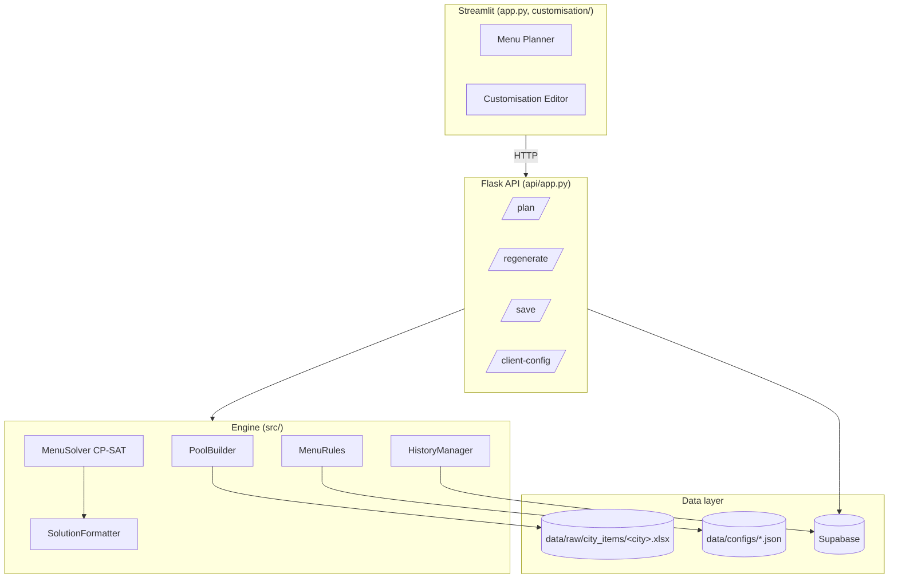
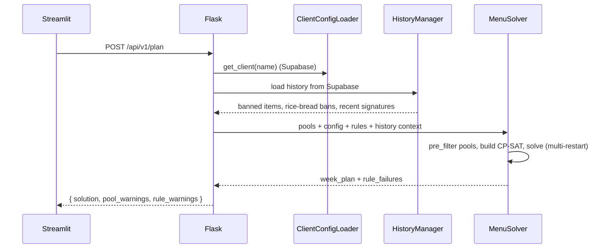

# Architecture

## Layer overview

| Layer | Location | Responsibility |
|---|---|---|
| Frontend | `app.py`, `customisation/`, `ui/` | Streamlit views, API client |
| API | `api/app.py`, `api/concurrency.py`, `api/logging_config.py`, `api/metrics.py` | REST surface, concurrent-solve gate, structured logging, in-process counters |
| Solver | `src/solver/` | CP-SAT model, multi-restart strategy, regeneration, solution formatting |
| Rules | `src/menu_rules/` | Hard/soft/pre-filter constraints, loaded from JSON |
| Preprocessor | `src/preprocessor/` | Excel ingest, column mapping, data cleanse, per-slot pool build |
| Client/History | `src/client/`, `src/history/` | Supabase-backed client config and menu history |
| Shared | `src/db.py`, `src/constants.py` | Supabase singleton, slot/flag constants |

## Key design choices

- **Cell-based CP-SAT:** one bool variable per `(day, slot, candidate item)`. Enables per-item bonuses / penalties and targeted regeneration.
- **Two-phase rules:**
  1. `pre_filter_pool()` — cheap removals before CP-SAT vars exist.
  2. `apply()` + `get_objective_terms()` — hard constraints and soft bonuses / penalties on the model.
- **Hard vs. soft severity:** rules declare `severity = HARD` (default) or `SOFT`. A hard rule that raises in `apply()` fails the solve instead of silently dropping the constraint; soft rules log + continue + surface in the response's `rule_warnings`.
- **Config is one JSON document:** a client's whole cuisine setup lives in `clients.counters` (JSONB) — an ordered, non-empty list `[{name, categories, slot_counts, theme_map}, …]`. `counters[0]` is the *primary* counter the solver plans from; extra entries are additional cuisine stations. Mode is derived (single ⇔ 1 counter, multi ⇔ 2+). A separate `clients.city` column holds an optional location. The old normalized `menu_categories` / `slot_count_overrides` / `theme_overrides` tables were folded into this column.
- **Multi-cuisine planning is client-orchestrated:** the planner calls `POST /plan` once per counter with `counter_index`, then renders one table per counter (tabs) with per-counter regenerate/clear plus a shared save/download.
- **No config cache:** `ClientConfigLoader` reads Supabase on every call so edits are live with no restart. Per-request memoization on Flask's `g` avoids the intra-request round trips.
- **Dynamic worker allocation:** `api/concurrency.py` caps concurrent solves (`MAX_RUNNING=2`) and tunes CP-SAT worker count to RAM (1 active → 9 workers, 2 active → 5 each).
- **History as JSON-per-day:** `menu_history` is one JSONB row per `(client, service_date)` — the day's whole menu is `menu = {slot: item_base}`. Item-level cooldown readers explode it in memory. `week_signatures` is week-level (a deterministic `|`-delimited hash of a saved week) and drives week-signature cooldown.
- **Non-veg tagging:** the API tags each solved item `is_nonveg` (derived from the ontology's `primary_protein` column, plus the `is_egg_dish` flag) so the UI and the Excel export render non-veg dishes red.
- **Themes:** mix/chinese/biryani/south/north/continental plus `chinese_continental`, a weekly-alternating meta-theme resolved by ISO-week parity in `weekday_type_for_config` before it reaches the pool filters (deterministic, no stored state).
- **Optional & combination categories:** `curd_rice` and the combos `dal_rasam`/`sambar_rasam`/`dal_sambar` are selectable-but-off-by-default base slots (`DEFAULT_OFF_SLOTS`). A combo is one slot whose pool is the union of two component course_types; the solver restricts each day to the majority or minority variant (`combo_minority_count`, e.g. 3 dal + 2 rasam over 5 days; `dal_sambar` = 3 dal + 2 sambar). Every combo is also in `EXEMPT_FROM_CUISINE` so its minority component (frequently a different cuisine, e.g. South sambar in a North week) isn't theme-filtered away on off-theme days.
- **Weekend service:** the client-level `clients.serve_weekends` flag makes date generation include Sat/Sun instead of skipping them.
- **Client item pools (F5):** the ontology `client` column tags each item with comma-separated pool tokens. A client's eligible universe is `common ∪ clients.source_pools` (deduped by `item_id`, exact case-insensitive token match — never substring). `api._menu_data_for_client` filters the cached full df to that subset and rebuilds per-slot pools (cached per active-pool set) **before** `build_pools`, so the whole rule pipeline runs on the merged pool and a borrowed item still obeys the target client's rules. `common` always covers every mandatory slot. `source_pools = null` (pre-migration) falls back to the full ontology.
- **Optimistic concurrency:** the `clients` table carries a `version` column. `GET /client-config` returns it as an ETag; `PUT` must send it back, mismatch returns 409 so two concurrent editors of the same client can't last-write-wins.

## Key flows

### Generate menu

### Save (overwrite semantics)

Streamlit → `POST /api/v1/save` → `HistoryManager.save()` upserts one `menu_history` row per `(client_name, service_date)` — the day's whole menu as a `{slot: item_base}` JSON document (PK `(client_name, service_date)`) — and replaces the `week_signatures` row for `(client_name, week_start)`. Re-saving a week therefore overwrites the prior plan instead of accumulating. Color suffixes (`(R)`, `(Y)`, …) are stripped before persistence so cooldown matching is color-agnostic. A multi-cuisine save sends `counters: [{name, week_plan}]` and stores a nested `{counter: {slot: item}}` menu.

### Pre-flight rule diagnostics

Before the solver runs, `api/app.py::_run_preflight` calls every rule's `BaseMenuRule.diagnose(ctx)` method against the assembled `DiagnoseContext` (pools, dates, day-types, history bans, client config). Results are aggregated by `src/menu_rules/diagnostics.py::run_diagnostics` and sorted by severity. A buggy rule's exception is converted to a `warning` Diagnostic — never `error` — so a regression in diagnose() code can't freeze the planner.

Endpoints:

- `POST /api/v1/diagnose` — pure read; runs the diagnostics and returns the structured envelope. Replaces the old `/validate-pools`.
- `POST /api/v1/plan` — runs the same diagnostics first. If any `severity=error` is present, returns **HTTP 422** with `rule_diagnostics` + `summary` and **skips the solver entirely**. Otherwise the solver runs and the diagnostics ride along on the 200 response.

The Streamlit UI catches `RuleDiagnosticsBlockedError` (the 422 path) and renders an inline expander showing the blocked rules + actionable suggestions; on 200, the expander shows any warnings/info entries collapsed by default. See `docs/api.md` for the response shape.

### Generate (with history-first read)

The Streamlit **Generate Menu Plan** button is deterministic for already-saved dates: it first hits `GET /api/v1/saved-plan?client_name&start_date&num_days`. If every requested weekday has saved rows, the response carries `exists: true` and the UI renders that saved plan with a "Loaded from history" badge. Otherwise (`exists: false`) the UI falls back to `POST /api/v1/plan` and runs the solver as usual.

`/saved-plan` is a pure read — it never invokes the solver. Color suffixes are re-attached server-side from the Excel ontology so the UI's renderer doesn't need a separate code path for saved vs fresh plans.

### Regenerate

Streamlit → `POST /api/v1/regenerate` → `MenuRegenerator` locks every cell not marked for replacement and re-runs the solver. A similarity penalty steers the solver away from re-picking the same items.

## Schema migrations

The schema is four tables (`clients`, `app_settings`, `menu_history`,
`week_signatures`). SQL under `scripts/`:

- `setup_all.sql` — **the master, idempotent script.** Creates every table,
  backfills `clients.counters` from an older normalized database, adds the
  `clients.city` column, and reshapes an old per-dish `menu_history` into the
  one-row-per-day JSON form. Run this once in the Supabase SQL editor.
  It creates `clients` (config in `counters` JSONB + `city` +
  optimistic-concurrency `version`), `app_settings`, `menu_history` (PK
  `(client_name, service_date)`, `menu` JSONB) and `week_signatures`, with RLS
  policies on each.

It is idempotent (`CREATE TABLE IF NOT EXISTS` / `ADD COLUMN IF NOT EXISTS`),
so re-running it on a live database is safe. It is the only schema script — the
`create_tables.sql` / `create_history_tables.sql` component files it superseded
have been removed, so there is one path to a correct schema rather than two.
