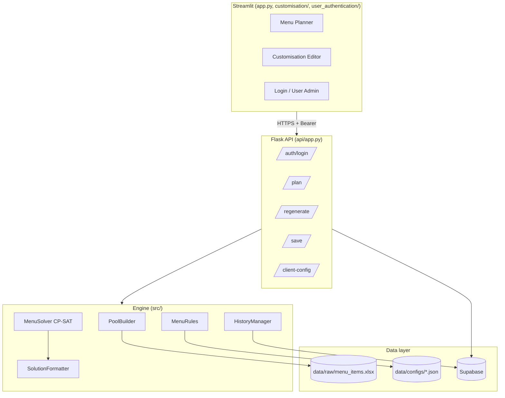
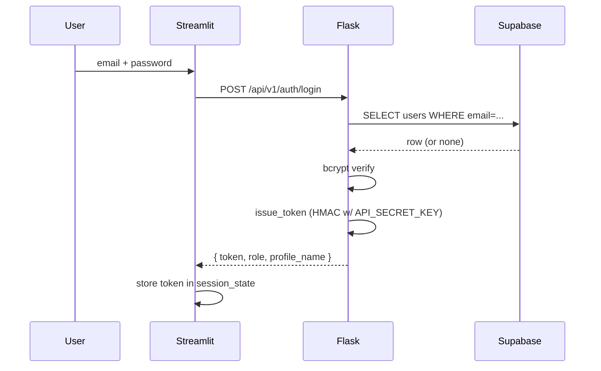
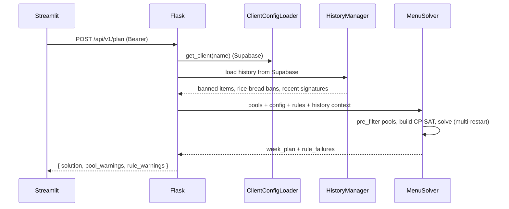

# Architecture

## Layer overview

| Layer | Location | Responsibility |
|---|---|---|
| Frontend | `app.py`, `customisation/`, `user_authentication/`, `ui/` | Streamlit views, login form, API client |
| API | `api/app.py`, `api/auth.py`, `api/concurrency.py`, `api/logging_config.py`, `api/metrics.py` | REST surface, bearer-token auth, concurrent-solve gate, structured logging, in-process counters |
| Solver | `src/solver/` | CP-SAT model, multi-restart strategy, regeneration, solution formatting |
| Rules | `src/menu_rules/` | Hard/soft/pre-filter constraints, loaded from JSON |
| Preprocessor | `src/preprocessor/` | Excel ingest, column mapping, data cleanse, per-slot pool build |
| Client/History | `src/client/`, `src/history/` | Supabase-backed client config and menu history |
| Shared | `src/db.py`, `src/constants.py` | Supabase singleton, slot/flag constants |

## Key design choices

- **Cell-based CP-SAT:** one bool variable per `(day, slot, candidate item)`. Enables per-item bonuses / penalties and targeted regeneration.
- **Two-phase rules:**
  1. `pre_filter_pool()` — cheap removals before CP-SAT vars exist.
  2. `apply()` + `get_objective_terms()` — hard constraints and soft bonuses / penalties on the model.
- **Hard vs. soft severity:** rules declare `severity = HARD` (default) or `SOFT`. A hard rule that raises in `apply()` fails the solve instead of silently dropping the constraint; soft rules log + continue + surface in the response's `rule_warnings`.
- **No config cache:** `ClientConfigLoader` reads Supabase on every call so edits are live with no restart. Per-request memoization on Flask's `g` avoids the intra-request round trips.
- **Dynamic worker allocation:** `api/concurrency.py` caps concurrent solves (`MAX_RUNNING=2`) and tunes CP-SAT worker count to RAM (1 active → 9 workers, 2 active → 5 each).
- **History split:** `menu_history` is item-level (one row per `(date, slot, item)`), `week_signatures` is week-level (a deterministic `|`-delimited hash of a saved week). The former drives item cooldown; the latter drives week-signature cooldown.
- **Optimistic concurrency:** the `clients` table carries a `version` column. `GET /client-config` returns it as an ETag; `PUT` must send it back, mismatch returns 409 so two admins editing the same client can't last-write-wins.

## Key flows

### Login

### Generate menu

### Save

Streamlit → `POST /api/v1/save` → `HistoryManager.save()` writes rows into `menu_history` and a row into `week_signatures`. Color suffixes (`(R)`, `(Y)`, …) are stripped before persistence so cooldown matching is color-agnostic.

### Regenerate

Streamlit → `POST /api/v1/regenerate` → `MenuRegenerator` locks every cell not marked for replacement and re-runs the solver. A similarity penalty steers the solver away from re-picking the same items.
